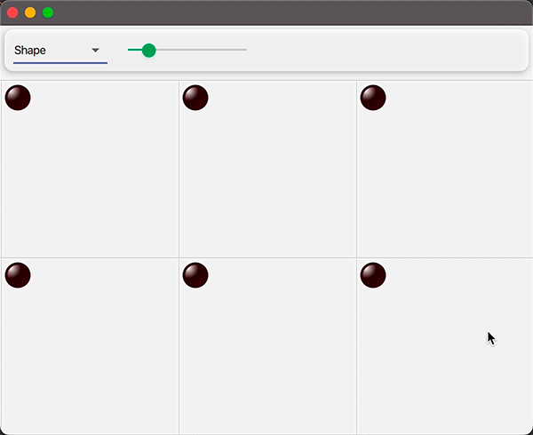
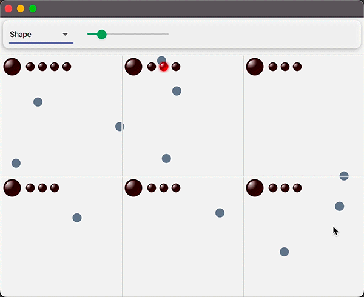
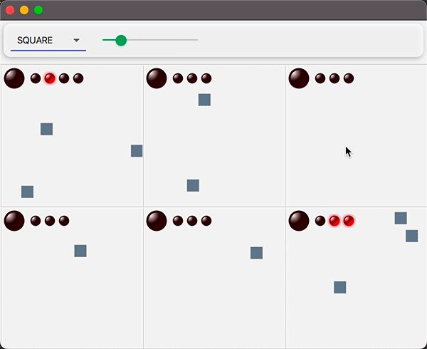
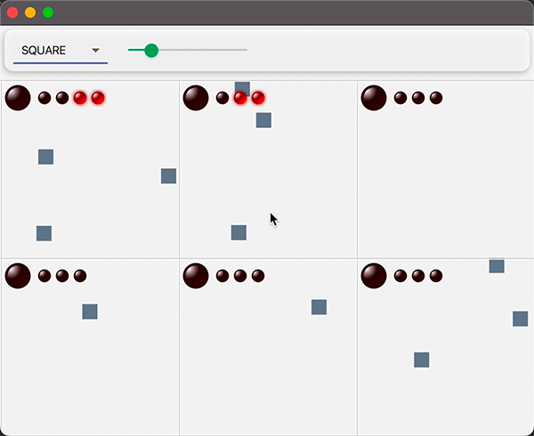

# Map Monitoring

- Virtual remote sensors are placed in a multi-patch world. 
- Each sensor sends data to patch's guardians
- Guardian checks if the data exceed a certain treshold, in that case it whould go in alarm state
- Guardians in a patch vote and reach consensus to establish if the whole patch is in alarm
- Click on patch button disable alarm state

## Sensors are remote nodes of a cluster
They are single actors, they could be placed remotely

## Behavior

## Alarm

## Consensus

